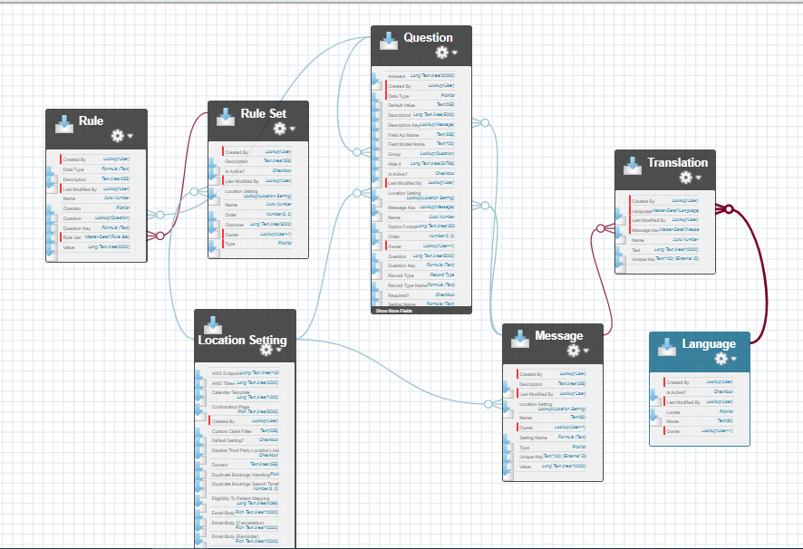

# Gearset Data Deployment

## References
- [Data deployments with Gearset](https://docs.gearset.com/en/articles/1376661-data-deployments-with-gearset)
    - Enabling, Security, Production
- [Running data deployment](https://docs.gearset.com/en/articles/2529745-running-your-first-data-deployment)
    - Step by step deployment from org to org
- [Data deployment templates](https://docs.gearset.com/en/articles/2529785-using-data-deployment-templates-for-repeatable-data-deployments)
    - Creating, using, and limitations
- [Configuring external ID and related objects](https://docs.gearset.com/en/articles/1613326-configuring-external-id-and-related-objects-for-a-data-deployment)
    - Deploying dependencies and upserting records

## Pre-deployment steps:
1. [ ] Deactivate Validation Rule `validateFieldModel` on Question object `skedbg__Question__c`
    - Go to `Setup` -> `Object Manager`, search and open `Question` object record, go to `Validation Rules` and open `validateFieldModel`.
    - Click `Edit` and check the `Active` checkbox off
    - Save the change

## Data Deplyment Steps:
1. Select source and target orgs
2. Select primary objects to deploy

## Post-deployment steps:
1. [ ] Activate Validation Rule `validateFieldModel` on Question object `skedbg__Question__c`
    - Go to `Setup` -> `Object Manager`, search and open `Question` object record, go to `Validation Rules` and open `validateFieldModel`.
    - Click `Edit` and check the `Active` checkbox on
    - Save the change